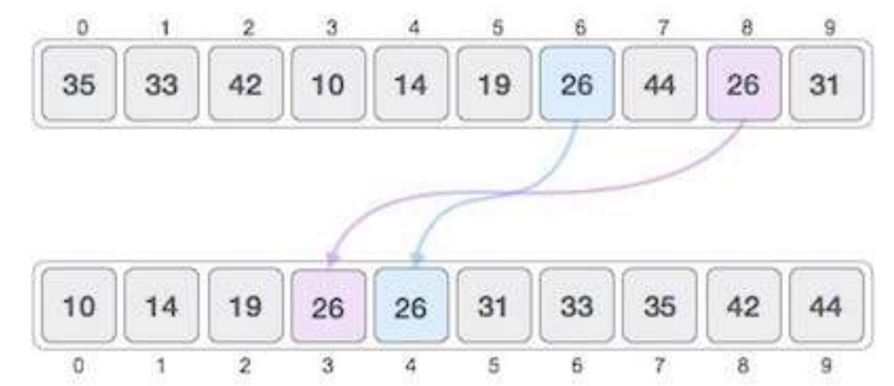

# Sorting

Sorting refers to arranging data in a sequential manner. It can be ascending or descending.

- Most common orders are numerical and lexicographical (dictionary) order.

The importance of sorting lies in the fact that data searching can be optimized to a very
high level, if data is stored in a sorted manner. Sorting is also used to represent data in
more readable formats. Following are some of the examples of sorting in real-life
scenarios:

## Telephone Directories

The telephone directory stores the telephone numbers of people sorted by their names, so that the
names can be searched easily.

## Dictionary

The dictionary stores words in an alphabetical order so that searching of any word becomes easy.

## In-Place Sorting

Sorting algorithms may require some extra space for comparison and temporary storage
of few data elements. These algorithms do not require any extra space and sorting is said
to happen in-place, or for example, within the array itself. This is called **In-Place** sorting.
**Bubble sort** is an example of in-place sorting.

## Not In-Place Sorting

However, in some sorting algorithms, the program requires space which is more than or
equal to the elements being sorted. Sorting which uses equal or more space is called **not-in-place** sorting.
**Merge-sort** is an example of not-in-place sorting.

## Stable Sorting

If a sorting algorithm, after sorting the contents, does not change the sequence of similar
content in which they appear, it is called stable sorting.

## Unstable Sorting

If a sorting algorithm, after sorting the contents, changes the sequence of similar content
in which they appear, it is called unstable sorting.

## Adaptive Sorting Algorithm

A sorting algorithm is said to be adaptive, if it takes advantage of already 'sorted' elements
in the list that is to be sorted. That is, while sorting if the source list has some element
already sorted, adaptive algorithms will take this into account and will try not to re-order
them.

## Non-Adaptive Sorting Algorithms

A non-adaptive algorithm is one which does not take into account the elements which are
already sorted. They try to force every single element to be re-ordered to confirm they 
are sorted.

## Increasing Order (Ascending Order)

A sequence of values is said to be in increasing order, if the successive element is greater
than the previous one. For example, 1, 3, 4, 6, 8, 9 are in increasing order, as every next
element is greater than the previous element.

## Descending Order (Decreasing Order)

A sequence of values is said to be in decreasing order, if the successive element is less
than the current one. For example, 9, 8, 6, 4, 3, 1 are in decreasing order, as every next
element is less than the previous element.

## Non-Increasing Order

A sequence of values is said to be in non-increasing order, if the successive element is
less than or equal to its previous element in the sequence. This order occurs when the
sequence contains duplicate values. For example, 9, 8, 6, 3, 3, 1 are in non-increasing
order, as every next element is less than or equal to (in case of 3) but not greater than
any previous element.

## Non-Decreasing Order

A sequence of values is said to be in non-decreasing order, if the successive element is
greater than or equal to its previous element in the sequence. This order occurs when the
sequence contains duplicate values. For example, 1, 3, 3, 6, 8, 9 are in non-decreasing
order, as every next element is greater than or equal to (in case of 3) but not less than
the previous one.
