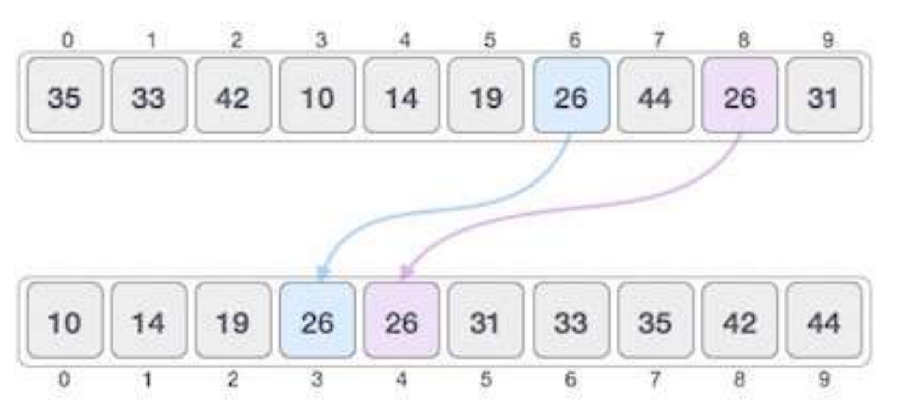

# Sorting

Sorting refers to arranging data in a sequential manner. It can be ascending or descending.

- Most common orders are numerical and lexicographical (dictionary) order.

The importance of sorting lies in the fact that data searching can be optimized to a very
high level, if data is stored in a sorted manner. Sorting is also used to represent data in
more readable formats. Following are some of the examples of sorting in real-life
scenarios:

## Telephone Directories

The telephone directory stores the telephone numbers of people sorted by their names, so that the
names can be searched easily.

## Dictionary

The dictionary stores words in an alphabetical order so that searching of any word becomes easy.

## In-Place Sorting

Sorting algorithms may require some extra space for comparison and temporary storage
of few data elements. These algorithms do not require any extra space and sorting is said
to happen in-place, or for example, within the array itself. This is called **In-Place** sorting.
**Bubble sort** is an example of in-place sorting.

## Not In-Place Sorting

However, in some sorting algorithms, the program requires space which is more than or
equal to the elements being sorted. Sorting which uses equal or more space is called **not-in-place** sorting.
**Merge-sort** is an example of not-in-place sorting.

## Stable Sorting

If a sorting algorithm, after sorting the contents, does not change the sequence of similar
content in which they appear, it is called stable sorting.

## Unstable Sorting

If a sorting algorithm, after sorting the contents, changes the sequence of similar content
in which they appear, it is called unstable sorting.

